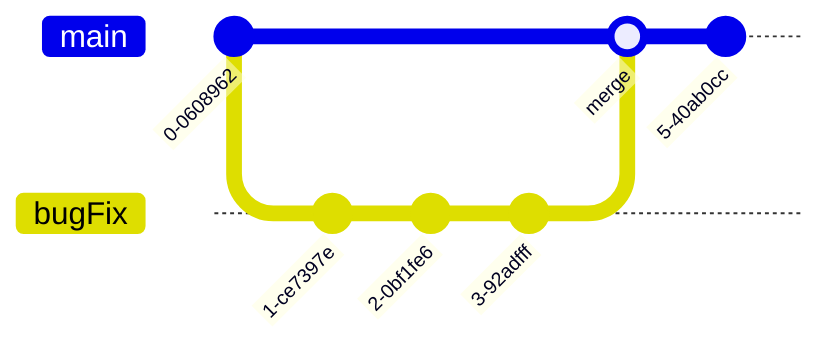

# github-intro

## Intro activity 1

You may perform these steps on the command line or using your preferred GitHub UI such as GitHub Desktop or VSCode/other IDE git integration. The command line commands are printed below each step. **IMPORTANT**: In order to run the `gh` command line actions, you must first have installed [gh cli](https://cli.github.com) and authenticated your local machine using the command `gh auth login`, then following the prompts. 

1. Fork this repo (and name the forked repo `github-intro-YOURNAME`)
2. Clone your forked repo onto your local computer
    * `git clone https://github.com/YOURUSERNAME/github-intro.git`
3. Open the repo folder in VSCode or your preferred text editor
4. Add a file to the study spaces folder recommending a good place to do computer work near Harvard
5. Commit your changes
    * `git add FILENAME`
    * `git commit -m "Add study spaces file"`
6. Push your changes to your forked repo
    * `git push`
7. Open a pull request to merge your changes into the original repo (can also do this on the GitHub website)
    * `gh pr create`
8. The maintainer (the instructor) will now review and approve your pull request
    * Note that the maintainer (an informatics staff) will have to approve the pull request, as this repo is owned by the informatics organization. So the below two lines is for reference if you have your own repo.
    * `gh pr checkout PRNUMBER`
    * `gh pr merge`
9. On your fork, sync your fork so your repo is updated (Do this on the github website)
10. Pull the changes from the your fork into your local repo
    * `git pull`

Here is a diagram of what you'll be doing in this part:

## Intro activity 2

Now we will be working on GitHub Desktop, the GitHub website, or VSCode git integration. Use whichever GUI you prefer. The equivalent command line commands to GUI options are printed below each step. We will be creating a branch and then working on the same file on two different branches to create a merge conflict. Branches are great for experimenting on a feature or fixing a bug without affecting the main code, but they can cause merge conflicts if two branches change the same line of code.

Example of branching:

1. Open your forked repo in your preferred text editor
2. Create an empty file called `haiku_yourname.md` in the `haikus` folder and commit & push it
    * `git add haikus/haiku_yourname.md`
    * `git commit -m "Add empty haiku file"`
    * `git push`
3. Start a new branch called `haiku-test`
    * `git checkout -b haiku-test`
4. Write 1-2 lines of the haiku and save it in the `haikus` folder
5. Commit your changes & push it
    * `git add haikus/haiku_yourname.md`
    * `git commit -m "Add haiku lines"`
    * `git push`
6. Switch back to branch `main` and observe that your haiku is still empty
    * `git checkout main`
    * `cat haikus/haiku_yourname.md`
7. Write a line in your empty haiku and commit & push it
    * `git add haikus/haiku_yourname.md`
    * `git commit -m "Add haiku line"`
    * `git push`
8. Open a pull request from `haiku-test` and try to merge it into `main`
    * `gh pr create`
    * `gh pr checkout PRNUMBER`
    * `gh pr merge`
9. Use the GitHub web interface or VSCode to resolve the merge conflict
10. Delete the branch once you are done merging (using the GitHub web interface, command line version printed for reference)
    * `git branch -d haiku-test`
11. (Optional) Submit a pull request to the original repo with your haiku so we can all see it!

For reference, this is the gitflow diagram for the above steps:

